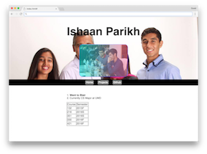
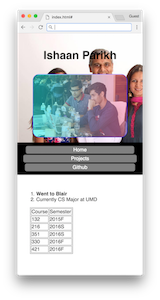

# Personal Website - An Introduction to HTML
### Out: 1/27/17 | Due: 2/3/17 11:59 PM

## Overview
For the project, you will create a simple website about you. This website will have pictures, links, text styling, and a few other features.

## Objectives
This project will give you practice with basic HTML and CSS.

## Grading

This project will use a feature and requirement based grading system (out of 50 points).

Points are gained by implementing features.

Requirements must be followed and failure to follow them may result in a 0.

## Specifications

We are going to be looking at a basic understanding of the HTML elements and CSS rules discussed in class.

The following must be in all projects:

HTML (5 points each):

1. One or more pictures - ``
2. Use of multiple pages (in addition to index.html) - linking with `<a />`
3. **Text** *styling* in some way ~~shape, or form~~.
4. Create a table and fill with information (no specifications to size) - `<table />`
5. Use the resources discussed in class to find another tag that we have not covered. Use them!

CSS (5 points each):

1. Two elements must have a class (class=""), and they must be styled using css
2. Two elements must have an id (id=""), and they must be styled using css
3. Use the following css declarations:
    - display: inline
    - display: block
4. Use the following css properies (1 point each):
    - background-color
    - width
    - height
    - margin
    - padding
5. Use media queries

## Requirements

This website must be about you! Must be *somewhat aesthetic*.

## Code Distribution

Clone the project folder located in this directory.

## Testing

No testing for this project in terms of public/secret tests. However, you can look at your own project by simply opening the `.html` file in your own browser!

## Example

| Part          | Image           
| ------------- |:-------------:
| Full Site      | 
| Media Queries (Mobile)      | 

## Submission

Upload your files as `LAST_FIRST_p1.zip` **only** to the submit server.
